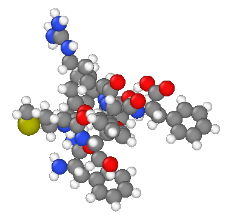
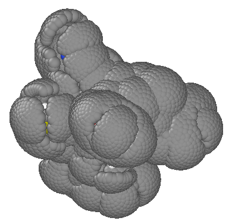

# pySASA

### Installation
``` bash
git clone https://github.com/avanteijlingen/pySASA
cd pySASA
python setup.py install
```

### Usage
```python
import pysasa
from ase.io import read

mol = read("ExampleData/Phe-Phe-Met-Ser-Ile-Arg-Phe-Phe.pdb")

# Load an instance of the pysasa class with a csv that contains the vdw_radii of the atoms/beads that exist in your system
calc = pysasa.pysasa(radii_csv="ExampleData/Alvarez2013_vdwradii.csv")

#Calculate the SASA, having more n_sphere_point will tend to give a more accurate result at the expensive of increased calculation time.
sasa = calc.calculate(mol.get_chemical_symbols(), mol.positions, n_sphere_point=500)
print("SASA:", sasa)
>>> SASA: 1106.724899510643

# With this module you can also get the per-atom surface area
print(calc.areas)
>>>       area atom  vdw_radius
0     3.294661    N        1.66
1     0.000000    C        1.77
2     0.000000    C        1.77
3     0.000000    O        1.50
4     3.030677    C        1.77
..         ...  ...         ...
149  22.256550    H        1.20
150  19.368296    H        1.20
151  15.460657    H        1.20
152  13.104714    O        1.50
153   0.000000    H        1.20

[154 rows x 3 columns]
```

### Visualizing the result

Finally we can write the Connolly surface to visualise the surface that we have calculationed

``` python
calc.writeConnolly("ConnollySurface.xyz")
```

 -> 
